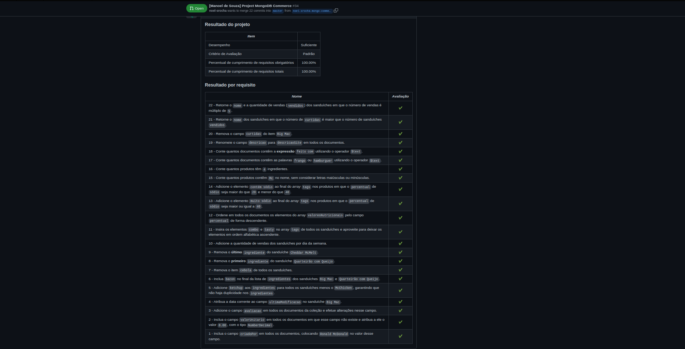

# Project MongoDB Commerce

### O que deverá ser desenvolvido

Today you will make a project with the codename _commerce_. In this project, you will practice all the **MongoDB** concepts taught so far.

For this project, we chose a much smaller dataset than the previous assignment, but that won't stop you from applying everything you've seen so far, combining the knowledge of this block and the previous one.

The idea is to work with the `commerce` database, which contains **McDonald's** menu data, such as ingredients, nutritional values ​​and fictitious sales data. Instructions on how to restore the bank can be read below.

### SKills to be Tested

In this project, I was able to:

  * Use the `updateOne()` and `updateMany()` methods;

  * Use operators `$set`, `$mul`, `$inc`, `$min`, `$max` and `$currentDate`;

  * Rename fields and remove fields;

  * Embed data in documents through arrays;

  * Use the `$pop`, `$pull` and `$push` operators;
  
  * Use the `$addToSet` operator;

  * Use the `$each`, `$slice` and `$sort` operators;

  * Use the `$all` operator to filter documents;

  * Use the `$elemMatch` operator to filter documents;

  * Use the `$size` operator to filter documents by the size of arrays;

  * Use the `$expr` operator to create aggregate expressions;

  * Use regular expressions and the `$regex` operator to search for documents;

  * Use the textual index and the `$text` operator;

  * Use the `$mod` operator;

### Evaluator Results

#### Disclaimer

THis assignment was developed by [Trybe](https://www.betrybe.com) in order to test my skills using MongoDB and its tools.
